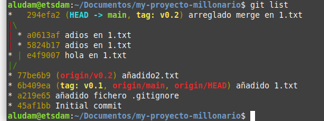

# My proyecto millonario

***Nombre: Jorge Mesa Marrero***
***Curso: 1º DAM*** 

### ÍNDICE

+ [Introducción](#id1)
+ [Objetivos](#id2)
+ [Material empleado](#id3)
+ [Desarrollo](#id4)
+ [Conclusiones](#id5)

#### ***Introducción***. 

Pondremos a prueba todo lo aprendido hasta ahora en la clase de Entornos de desarrollo.

#### ***Objetivos***. 

- Empezar con Git innit.
- Clonar repo.
- Practicar pull and push desde el repositorio remoto.
- Crear carpetas y texto en privado y que sean ignorados por git.
- Crear Tag.
- Crear ramas

#### ***Material empleado***. 

1. Máquina virtual.
2. Disco duro SSD
3. Repositorio de Github.
4. programa Git.
5. Programas de texto plano. 

#### ***Desarrollo***. 

1. Primero creamos un repo en Github llamado: My-proyecto-millonario.
2. Commit inicial y haciendo un push.
3. Ejercicios de para ignorar archivos por git.
    - crear texto con la funcion touch  y creando una carpeta con mkdir.
    - con el comando echo ponemos: .gitignore.
4. añadimos fichero en repositorio local.
5. creamos un tagv0.1 y subimos con push el tag v0.1 a nuestro repo.
6. creamos una rama con git branch y podemos movernos de rama a origin con git checkout (+nombre).
7. añadimos ficheros para hacer uin merge.
    - Primer merge sin conflictos.
    - Segundo merge con conflictos.
8. Arreglamos el merge con conflicto y terminamos con un add . y commit.
9. Borramos rama después del merge y listamos como ha quedado nuestra main.

#### ***Conclusiones***. 

> Ejercicios prácticos son importantes para poder aprender git de forma más dinámica y quedarte poco a poco con las sintaxis.
> Aprovechar estos ejercicios y los README.md para poner en práctica la sistaxis Markdown. 

