# ANDROID STUDIO  |  UT3 A1  | 1º DAM
### Gustavo Delgado Torres | Jorge Mesa Marrero | Sebastián Laya González


#### Presentación asociada
[Click aquí](https://www.canva.com/design/DAG4augGXEA/KDiMCEOHqn-EXclf9OJEeA/view?utm_content=DAG4augGXEA&utm_campaign=designshare&utm_medium=link2&utm_source=uniquelinks&utlId=hf1caa7a2df)

<br>
<br>
<br>

# Índice
  - [Historia y Contexto](#Historia-y-Contexto)
    - [Año de creación, autores o empresa desarrolladora](#Año-de-creación-autores-o-empresa-desarrolladora)
    - [Lenguajes o tecnologías a las que se orienta](#Lenguajes-o-tecnologías-a-las-que-se-orienta)
    - [Lenguajes de programación](#Lenguajes-de-programación)
  - [Instalación](#Instalación)
    - [Máquina virtual](#Máquina-virtual)
    - [Descarga del IDE](#Descarga-del-IDE)
  - [Partes y usos del IDE](#Partes-y-usos-del-IDE)
    - [Plug-ins más utilizados:](#Plug-ins-más-utilizados)
  - [Ejemplo práctico](#Ejemplo-práctico)
  - [Conclusión](#Conclusión)
  - [Anexo | Código ejemplo](#Anexo--Código-ejemplo)

<br>
<br>
<br>


## Historia y Contexto

### Año de creación, autores o empresa desarrolladora

Android Studio es el entorno de desarrollo integrado oficial para la plataforma Android. 

Fue anunciado el 16 de mayo de 2013 en la conferencia Google I/O, y reemplazó a Eclipse como el IDE oficial para el desarrollo de aplicaciones para Android. 

 La primera versión estable fue publicada en diciembre de 2014. Android Studio admite otros lenguajes de programación, como Java y C ++

Google desarrolló Android Studio, basándose en el proyecto IntelliJ IDEA de JetBrains y añadiendo herramientas específicas para el desarrollo de aplicaciones Android. No hay un único creador, ya que fue desarrollado por un equipo de Google, que previamente había adquirido Android Inc*...

*Android Inc. fue fundada en octubre de 2003 por Andy Rubin, Rich Miner, Nick Sears y Chris White.


### Lenguajes o tecnologías a las que se orienta

Android Studio es el IDE oficial para el desarrollo de aplicaciones Android y soporta varios lenguajes y tecnologías, cada uno con sus características y usos específicos.

### Lenguajes de programación

| Lenguaje | Descripción                                                   |
|----------|--------------------------------------------------------------|
| Java     | Lenguaje tradicional para el desarrollo de Android.         |
| Kotlin   | Lenguaje moderno recomendado por Google para Android.        |
| C++      | Utilizado para el desarrollo de aplicaciones con código nativo.|

**Kotlin es el lenguaje de programación preferido por los desarrolladores para Android Studio.**

| **Tecnología/Herramienta** | **Descripción**                                                  |
|-----------------------------|-----------------------------------------------------------------|
| XML                         | Lenguaje de marcado usado para definir la interfaz de usuario.   |
| Gradle                      | Herramienta de automatización de proyectos para gestionar dependencias. |
| Jetpack                     | Conjunto de bibliotecas para facilitar el desarrollo de aplicaciones.  |
| Firebase                    | Plataforma que proporciona varios servicios para aplicaciones móviles.  |
| Android Compose             | Framework para construir interfaces de usuario de manera declarativa.      |


| Versión         | Fecha de lanzamiento       | Características claves                                             |
|------------------|---------------------------|-------------------------------------------------------------------|
| 1.0              | Diciembre 2014            | Lanzamiento oficial Android Studio como IDE para Android.         |
| 1.1              | Abril 2021                | Introducción de características como el instant run.              |
| 3.0              | Octubre 2017              | Mejora en el soporte para Kotlin; Gradle mejorado y AndroidX.    |
| 4.0              | Mayo 2020                 | Integración de Jetpack Compose y nuevas herramientas.             |
| 4.1              | Noviembre 2020            | Nuevas funcionalidades para la optimización de proyectos.         |
| 2020.3.1 (Artic Fox) | 2020                     | Actualizaciones de soporte de dispositivo y mejoras generales.     |
| 2021.1.1 (BumbleBee) | 2021                     | Actualizaciones en soporte de gradle, optimización de imágenes.   |
| 2021.3.1 (Chipmunk) | 2022                     | Mejora en el manejo de temas, más herramientas de análisis.       |
| 2022.3.1 (Giraffe) | 2022                     | Movimiento hacia el soporte de Android 12.                       |
| 2024.1.1 (Koala)  | 2024                     | Incorporo Gemini API (capabilities, IA), mejoras en la interfaz y nuevos dispositivos. |


## Instalación

### Máquina virtual

Para la máquina virtual hemos decidido usar la misma que usamos en la asignatura, en este caso un modelo Linux Mint, Ubuntu de 64 bit. Respecto a los recursos otorgados para la instalación hemos optado por 4096 MB de RAM, 4 núcleos y 16 MB de VRAM. Estas características son las mínimas para pasar la instalación sin problemas, sin embargo, recomendamos por lo menos 1024 MB de VRAM y 8 GB de RAM para poder tratar el IDE con fluidez.

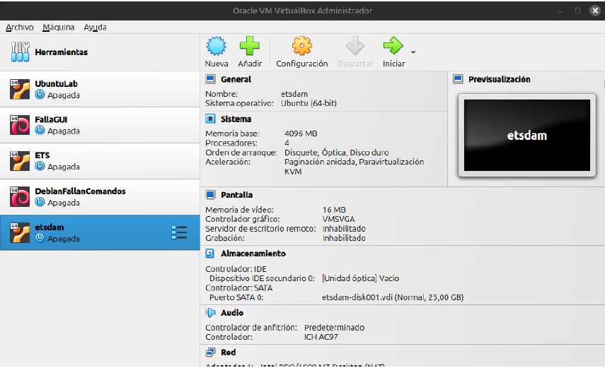

### Descarga del IDE
Para descargar el IDE vamos a la página web de Android Studio, dónde encontraremos la siguiente interfaz: 

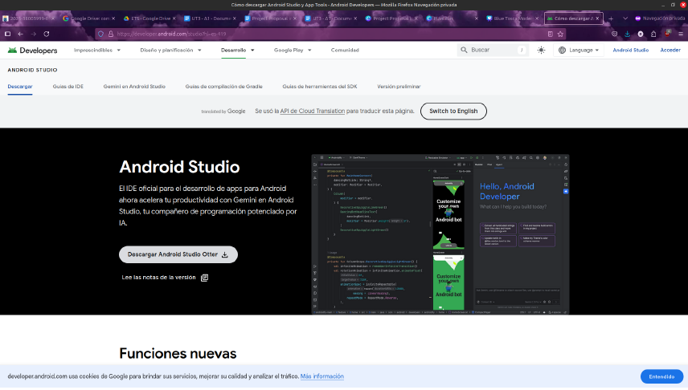

Tras esto hacemos click en el botón Descargar Android Studio Otter y se nos descargará un comprimido (.tar) con el programa para Linux. Lo descomprimimos haciendo click derecho y pulsando en “Extraer aquí” para que nos quede una carpeta, que ubicamos en nuestra ruta de instalación preferida (recomendamos que sea en la carpeta root).

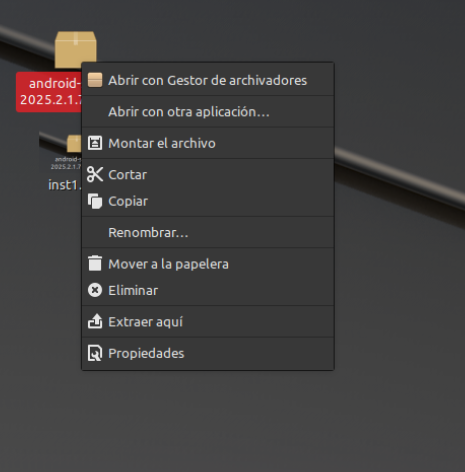

Si abrimos dicha carpeta encontraremos un txt con las instrucciones de instalación para Linux.

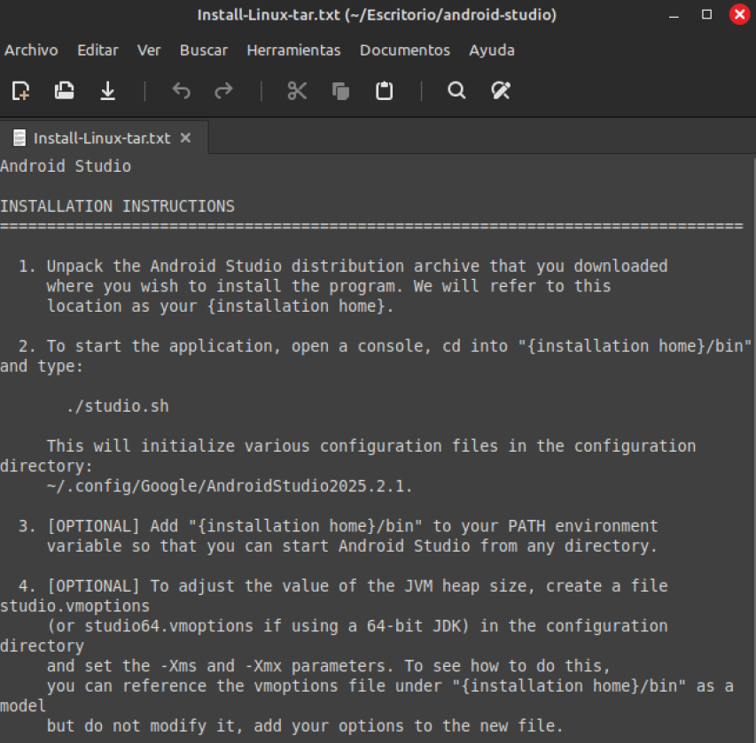

Abriremos la terminal de linux con Ctrl + Alt + T y entraremos en la ruta marcada, en este caso “Escritorio/android-studio/bin” y una vez en el directorio escribiremos ./studio.sh para comenzar la instalación. Tras ello, de forma opcional, podemos añadir la ruta a nuestro PATH para poder iniciar el Android Studio desde cualquier directorio vía consola.

A continuación procederemos con el instalador de forma bastante simple e intuitiva:

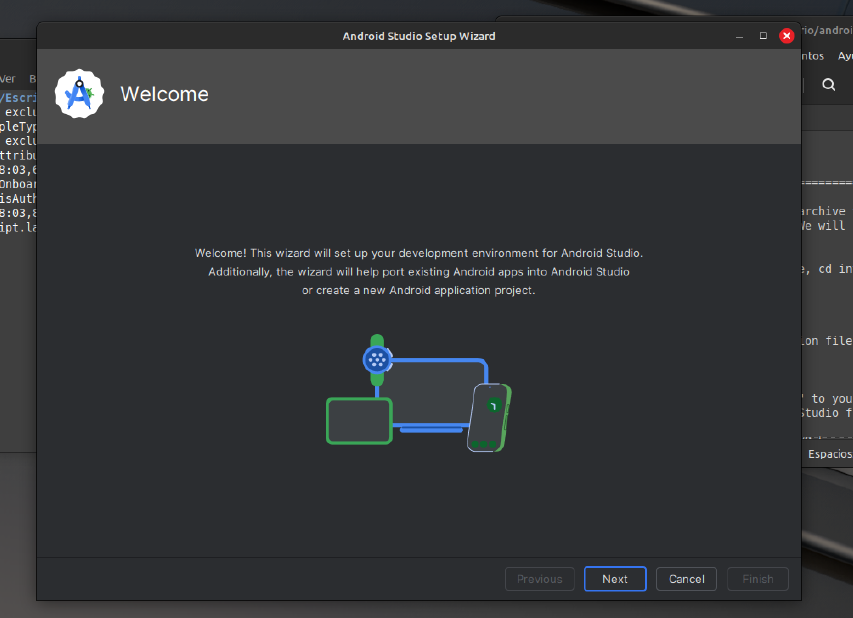
Hacemos click en ***next***


Hacemos click en ***next*** de nuevo

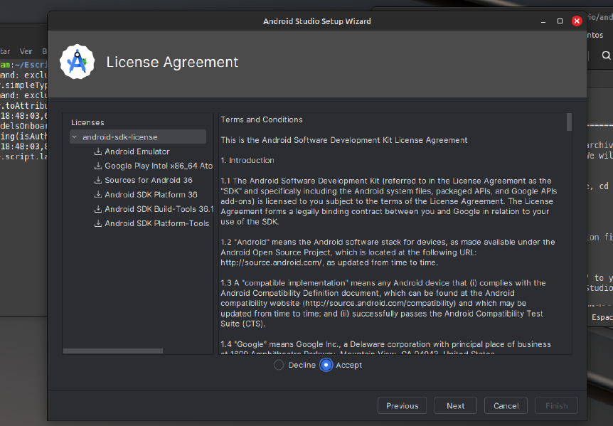
Aceptamos los acuerdos de licencia tras leerlo y continuamos con la instalación

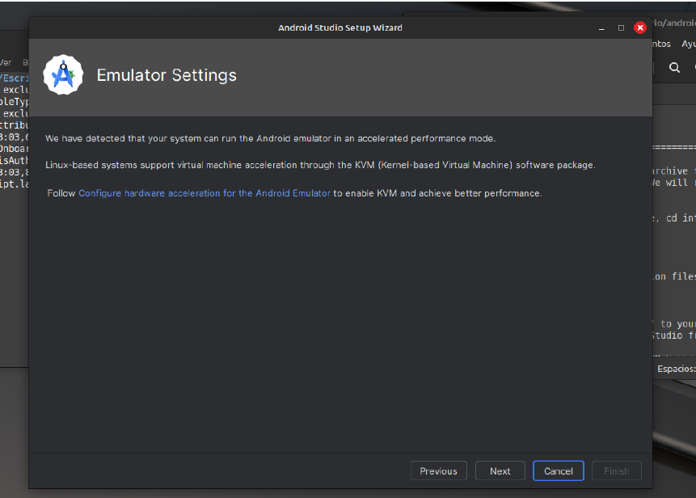
Confirmamos los ajustes de emulador

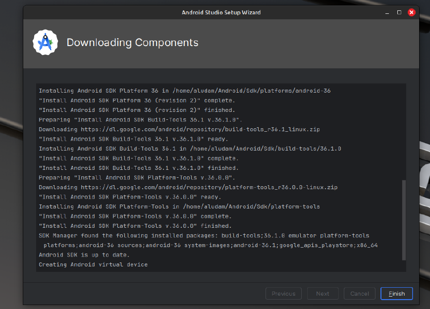
Esperamos a que se descarguen todos los componentes necesarios (puede tardar varios minutos). Una vez finalizado pulsamos ***Finish*** para terminar la instalación.

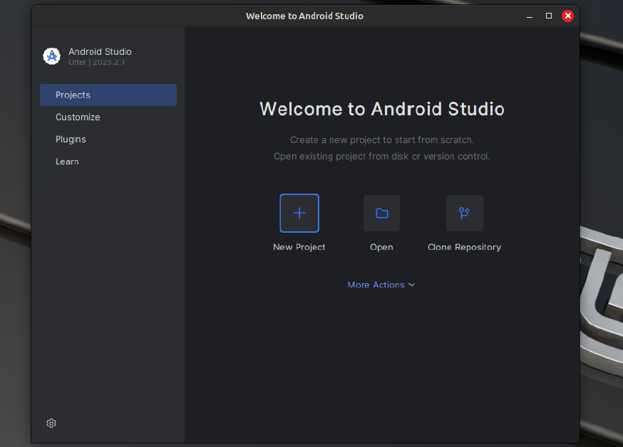
Y finalmente tendremos nuestro Android Studio listo para su uso.

## Partes y usos del IDE

Como herramientas integradas para el desarrollo o construcción de programas en Android, contiene una interfaz de usuario que  es construida o diseñada previamente, con variados modelos de pantalla, donde en ella  los elementos existentes pueden ser desplazados. Adicionalmente se incluyen depuradores para emuladores y la posibilidad de trabajar con Logcat. IntelliJ IDEA soporta varios lenguajes que se basan en JVM; Java (por ello la «J» de IntelliJ),  Clojure, Groovy, Kotin y Scala. Más un soporte para Maven y Gradle.  Con esta tecnología, asociada a Android Studio, las posibilidades son cómodas para la creación y construcción de aplicaciones para este sistema.

Android Studio posee distintos componentes que ayudan a la tarea de la construcción de aplicaciones; sistema de construcción basado en Gradle, la construcción de variantes y múltiples archivos APK, como también plantillas de código que ayudan a la creación de aplicaciones. Un completo editor de diseño con soporte para la edición de arrastrar y soltar el tema elementos. 

Entre las numerosas herramientas de **Android Studio** se encuentran:

- **Editor de código:** El editor de código de Android Studio es un editor inteligente y avanzado con características como la finalización automática de código para Kotlin, Java y C + +, la asistencia para refactorizaciones y la corrección de errores en tiempo real. También incluye un editor de diseño visual para la interfaz de usuario, la posibilidad de previsualizar el código en múltiples dispositivos y el resaltado de sintaxis mejorado para lenguajes como CMake.


- **Compilador / Intérprete:** Las principales características del compilador de Android Studio incluye un sistema de compilación flexible y automatizado basado en Gradle, la compatibilidad con lenguajes como Java, Kotlin y C++, y herramientas que permiten la compilación en paralelo para mejorar el rendimiento. Estas características optimizan la compilación de aplicaciones, permiten crear variantes de compilación para diferentes dispositivos y facilitan la depuración del código.

Para compilar el código, se deben de seguir los siguientes pasos:
1. En la barra de herramientas, selecciona la app en el menú de configuración de ejecución.
2. En el menú del dispositivo de destino, selecciona el dispositivo en el que deseas ejecutar la app.
3. Si no tienes ningún dispositivo configurado, debes crear un dispositivo virtual de Android para usar Android Emulator o conectar un dispositivo físico.
4. Haz clic en **Run**

Android Studio te advertirá si intentas iniciar el proyecto en un dispositivo que tiene un error o una advertencia asociados. La iconografía y los cambios estilísticos diferencian entre errores (selecciones de dispositivos que dan como resultado una configuración dañada) y advertencias (selecciones del dispositivo que pueden dar como resultado un comportamiento inesperado, pero aún se pueden ejecutar).

- **Depurador:** Android Studio proporciona un depurador que te permite hacer lo siguiente y mucho más: Seleccionar un dispositivo para depurar tu aplicación. Establecer puntos de interrupción en tu código Java, Kotlin y C/C + +. Examinar variables y evaluar expresiones en tiempo de ejecución.

Para depurar un proceso de aplicación de Java o Kotlin, haz lo siguiente:
1. Establece puntos de interrupción en tu código Java o Kotlin dentro de ASFP.
2. En el menú, selecciona Run > Attach Debugger to Android Process.
3. En el diálogo Choose Process, asegúrate de que el Tipo de depuración esté configurado como Solo Java.
4. Selecciona tu dispositivo en la lista.
5. Elige el proceso de solicitud específico que deseas depurar.
6. Haz clic en OK.
7. Interactúa con la aplicación en tu dispositivo para alcanzar los puntos de interrupción.

   
Para depurar un proceso del sistema escrito en C o C++, haz lo siguiente:
1. Verifica que solo se esté ejecutando un dispositivo o emulador.
2. Abre una terminal y ejecuta adb root desde la raíz de la confirmación de AOSP: bash adb root
3. Establece puntos de interrupción en tu código C/C + + dentro de ASFP.
4. En el menú, selecciona Run > Attach Debugger to Android Process.
5. En el diálogo Choose Process, cambia el Debug type a Native Only o Dual (Java + Native).
6. Marca la casilla Show all processes para ver los procesos del sistema.
7. Selecciona tu dispositivo en la lista.
8. Elige el proceso específico del sistema que deseas depurar (como surfaceflinger o system_server).
9. Haz clic en OK.
10. El depurador se adjunta al proceso. Interactúa con el dispositivo para alcanzar tus puntos de interrupción.

- **Control de versiones:** El control de versiones en Android Studio se integra con sistemas como Git a través del menú VCS, permitiendo rastrear cambios, trabajar en equipo y gestionar el historial del código. Para activarlo, ve a VCS > Enable Version Control Integration y selecciona Git. La ventana de control de versiones (Atajo: Alt + 9 en Windows/Linux, Cmd + 9 en mac OS) muestra los cambios locales, la consola y el historial del proyecto.
   
- **Refactorización:** La refactorización en Android Studio es un proceso de reestructuración del código que mejora su calidad interna (legibilidad, mantenibilidad, rendimiento) sin alterar su comportamiento externo.

Un ejemplo de refactorización podría ser, el reconsiderar los nombres de las variables. En Android Studio  se puede hacer uso de la inteligencia artificial Gemini para sugerir cambios de nombres de variables según el contexto del código; además de poder ser realizado manualmente. Para está función se debe hacer doble clic en un nombre sugerido para actualizar todas las instancias del nombre de la variable.

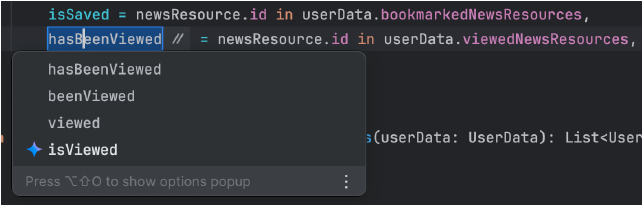

Para repensar todas las variables de la función o el archivo actuales, coloca el cursor en la función o en el nivel superior del archivo (fuera de cualquier función), respectivamente. Luego, haz clic con el botón derecho y selecciona Gemini > Rethink variable names. Aparecerá un diálogo en el que podrás revisar los nombres sugeridos y aceptar solo los que te gusten.


### Plug-ins más utilizados:

- ADB Idea: Facilita usar comandos ADB (instalar, desinstalar, limpiar datos, reiniciar apps, gestionar permisos, etc.) desde una interfaz gráfica.


- **Flutter Plugin:** Permite crear y desarrollar proyectos Flutter en Android Studio, instalando también Dart.


- **SonarLint:** Analiza el código en tiempo real, detecta errores y vulnerabilidades, y ayuda a mejorar la calidad del software.


- **RoboPOJOGenerator:** Genera automáticamente clases POJO en Java o Kotlin a partir de JSON complejos.


- **Android Drawable Preview:** Muestra una vista previa de archivos drawable XML directamente en el IDE, acelerando el diseño visual.

## Ejemplo práctico
Breve demostración del desarrollo de un pequeño proyecto o script (por ejemplo, “Hola mundo” o una función simple).

Primero creamos el proyecto:


Se crearon dos ejemplos sencillos donde se puede ver en la interfaz “Hello World” y una función sencilla donde podemos introducir una cadena de texto y nos saluda automáticamente.

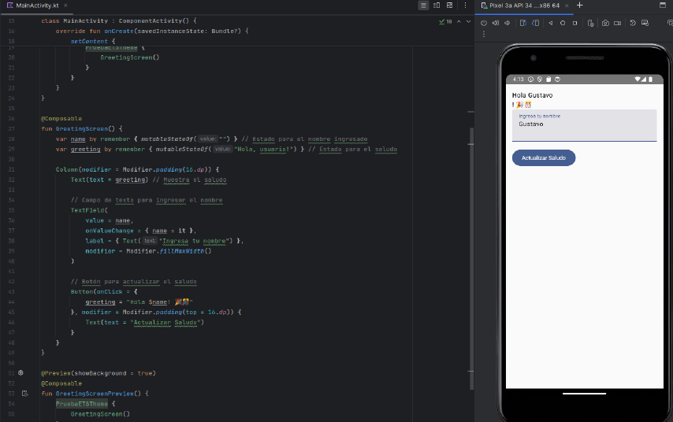


## Conclusión
Android Studio es el IDE oficial y más completo para la creación de aplicaciones Android. A lo largo de este trabajo, hemos analizado su evolución, características principales, proceso de instalación y herramientas integradas, lo que nos permite destacar sus ventajas frente a otras alternativas:

- **Soporte nativo y actualizado:** Al ser desarrollado por Google, ofrece compatibilidad inmediata con las últimas versiones de Android, librerías como Jetpack Compose, y lenguajes modernos como Kotlin, el cual es actualmente el recomendado para el desarrollo Android.

- **Herramientas integradas:** Incluye emuladores eficientes, un editor inteligente con autocompletado, refactorización, depuración avanzada para Java, Kotlin y C++, y integración con Gradle para la gestión de dependencias.

- **Ecosistema amplio:** Gracias a su base en IntelliJ IDEA, permite el uso de una gran cantidad de plugins (como ADB Idea, Flutter, SonarLint) que extienden sus funcionalidades.

- **Gratuito y de código abierto:** A diferencia de otros IDEs móviles, Android Studio es completamente gratuito y cuenta con una comunidad activa.

Sin embargo, también presenta algunos inconvenientes:

- **Consumo de recursos:** Requiere equipos con RAM suficiente (recomendable 8 GB o más) y un SSD para un rendimiento fluido, especialmente al usar el emulador.

- **Curva de aprendizaje:** Para desarrolladores noveles, la cantidad de herramientas y configuraciones puede resultar abrumadora.

- **Enfoque específico:** Aunque permite desarrollo en C++ y Flutter, está optimizado principalmente para Android, por lo que no es la mejor opción para desarrollo multiplataforma puro.

Respecto al uso recomendado, recomendamos el uso de Android Studio en los siguientes escenarios:

Desarrollo nativo de aplicaciones Android en Java o Kotlin.

Proyectos que requieran integración con servicios de Google (Firebase, ML Kit, etc.).

Equipos que prioricen un entorno oficial, estable y con soporte continuo.

Entornos educativos o formativos donde se busque una transición natural hacia el desarrollo móvil profesional.

No sería la opción ideal para proyectos que requieran desarrollo simultáneo para iOS y Android con un mismo código, donde alternativas como Flutter (aunque también se puede usar en Android Studio) o React Native podrían ser más adecuadas.

En definitiva, Android Studio es la herramienta de referencia para cualquier desarrollador Android, siempre que se cuente con el hardware adecuado y se esté dispuesto a aprovechar todo su potencial.

## Anexo | Código ejemplo
```
package com.example.pruebaets

import android.os.Bundle
import androidx.activity.ComponentActivity
import androidx.activity.compose.setContent
import androidx.compose.foundation.layout.*
import androidx.compose.material3.Button
import androidx.compose.material3.Text
import androidx.compose.material3.TextField
import androidx.compose.runtime.*
import androidx.compose.ui.Modifier
import androidx.compose.ui.tooling.preview.Preview
import androidx.compose.ui.unit.dp
import com.example.pruebaets.ui.theme.PruebaETSTheme
class MainActivity : ComponentActivity() {
   override fun onCreate(savedInstanceState: Bundle?) {
       super.onCreate(savedInstanceState)
       setContent {
           PruebaETSTheme {
               GreetingScreen()
           }
       }
   }
}

@Composable
fun GreetingScreen() {
   var name by remember { mutableStateOf("") } // Estado para el nombre ingresado
   var greeting by remember { mutableStateOf("Hola, usuario!") } // Estado para el saludo

   Column(modifier = Modifier.padding(16.dp)) {
       Text(text = greeting) // Muestra el saludo

       // Campo de texto para ingresar el nombre
       TextField(
           value = name,
           onValueChange = { name = it },
           label = { Text("Ingresa tu nombre") },
           modifier = Modifier.fillMaxWidth()
       )

       // Botón para actualizar el saludo
       Button(onClick = {
           greeting = "Hola $name! 🎉🎊"
       }, modifier = Modifier.padding(top = 16.dp)) {
           Text(text = "Actualizar Saludo")
       }
   }
}

@Preview(showBackground = true)
@Composable
fun GreetingScreenPreview() {
   PruebaETSTheme {
       GreetingScreen()
   }
}


```
